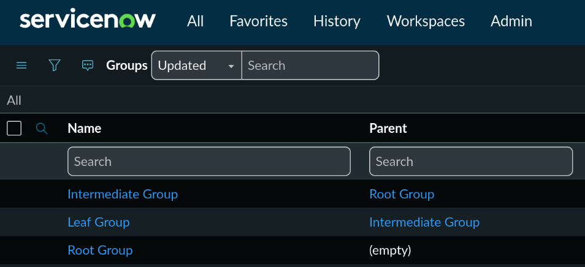
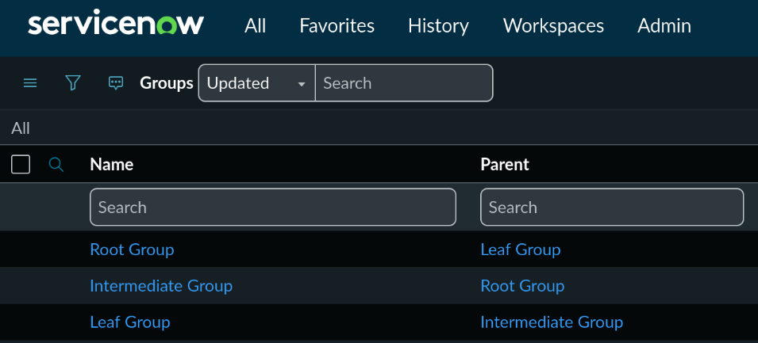

I'm going to start off with a simple funciton to get the root node from a child
node. I plan to expose all these functions under a script include namespace
called "Tree", so let's get our namespace created first.

## Creating the Tree namespace

In ServiceNow, I typically prefer exposing standalone methods under a namespace,
rather than a class. I may go into more detail on why I prefer this pattern and
cover some of the other options, but it's not overly important for now. We'll
just create a new script include named Tree with the tiny boiler plate below.

#### Tree.js

```js
const Tree = {};
(() => {
  // TODO
})();
```

The first line creates the Tree namespace that we can attach our publicly
exposed methods and properties to. The immediately invoked function expression
(IIFE) just below is used so that we can declare private functions and variables
if needed. Anything defined within the IIFE will be accessible only within the
IIFE. For the methods we want to expose to other users, we add it as a property
on the Tree object.

## Get root node

Getting the root node is pretty simple - we just get the parent node repeatedly
until there are no more parent nodes. This could be done in a loop, but I think
a simple recursive function makes things cleaner. We should also take a field
name as an input parameter, as the reference may not always be on a field
literally named parent.

#### Tree.js

```js
const Tree = {};
(() => {
  /**
   * returns the root node of a given node
   * @param {object} params - named function parameters
   * @param {GlideRecord} params.node - the current node being processed
   * @param {string} [params.parentField=parent] - name of the parent reference field
   */
  Tree.getRootNode = ({ node, parentField = "parent" }) => {
    if (!node || !node.isValidRecord())
      throw Error("missing or invalid parameter: node");
    // no more parent fields - this is our root node
    if (!node[parentField]) return node;
    // get the parent node, then call the function again using the parent node
    let parentNode = node[parentField].getRefRecord();
    let root = Tree.getRootNode({ node: parentNode, parentField });
    return root;
  };
})();
```

This works, but there is a potential issue. We could have a cyclic recursion,
where nodes are related as `A->B->C->A`. Depending on the use case and the
table, this type of scenario can easily be prevented with a business rule, but
since we don't know where our utilities will end up being used, I think it is
best to make them as generic and robust as possible.

## Preventing endless recursion

We can use a standard array to track the call stack/visited nodes of the current
branch. Each time we call our function, we push that node to the stack. When
traversing multiple branches in a tree, we would also want to remove the element
from the stack just before we return. This allows the same node to appear
multiple times in the tree, but not multiple times in the same branch, which
would cause endless recursinon. Since we're only traversing a single branch, we
don't need to worry about that yet, but we will for our DFS and BFS algorithms.

As an example, depending on the schema design, we might have a valid scenario
where the same node (`Leaf01` in this case) appears multiple times in the tree
by design, most frequently in many-to-many relationships.

```
Root
├── Intermediate_01
│	└── Leaf
└── Intermediate_02
	└── Leaf
```

But we never want to allow a scenario like below, or the function recurse
infinitely. We will throw an `Error` if we encounter branch with a reference
loop.

```
Root ────────────────┐
 └── Intermediate    │
	  └── Leaf◀─────┘
```

Here is the code that will maintain the stack path to prevent endless recursion.

#### Tree.js

```js
const Tree = {};
(() => {
  /**
   * returns the root node of a given node
   * @param {object} params - named function parameters
   * @param {GlideRecord} params.node - the current node being processed
   * @param {string} [params.parentField=parent] - name of the parent reference field
   */
  Tree.getRootNode = ({ node, parentField = "parent", stackPath = [] }) => {
    if (!node) throw Error("missing required parameter: node");
    if (!node.isValidRecord())
      throw Error("node parameter must be a valid GlideRecord");

    // ensure the current node is not already in the path
    let nodeId = node.getUniqueValue();
    if (stackPath.includes(nodeId))
      throw Error(
        "recursive reference found in path:" +
          stackPath.concat(nodeId).join("->"),
      );
    stackPath.push(nodeId);

    // no more parent fields, return the root node
    if (!node[parentField]) return node;

    // get the parent node, then call the function again using the parent node
    let parentNode = node[parentField].getRefRecord();
    return Tree.getRootNode({ node: parentNode, parentField, stackPath });
  };
})();
```

For a simple test, I created three User Groups, related them as below, and ran a
background script to invoke the newly created function.


```js
let node = new GlideRecord("sys_user_group");
node.get("0119112e2b04ba907f83fedba291bf8d");

let root = Tree.getRootNode({ node });
gs.info(root.getDisplayValue());
// output: Root Group
```

ServiceNow prevents recursive User Group references, so I ran a background
script to force update a group to have a recursive reference.


Running the same background script as our previous test should now throw an
`Error` like below.

```
recursive reference found in path: 0119112e2b04ba907f83fedba291bf8d-->4509ddea2b04ba907f83fedba291bf7c-->9ef89dea2b04ba907f83fedba291bf14-->0119112e2b04ba907f83fedba291bf8d
```

## Up Next

Getting the root node from a leaf can be useful, but there's many cases where we
want to perform some action on each node visited. To accomplish this, we'll
create a funcion to traverse to the root node, executing a callback on each node
visited.

<Alert type="note">
The full up to date Tree namespace script include can be found [Tree.js](/scripts/Tree.js)
</Alert>
