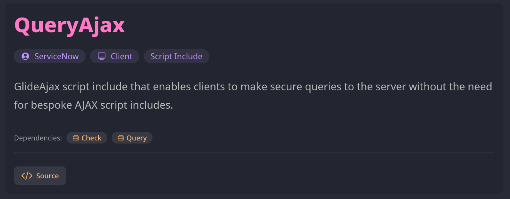

It's going to be another shorter post today, as I've been hard at work on making
the UI of my documentation pages much more user friendly. This was a lot more
work than I originally expected. There was enough interesting problems to solve
that I probably should have written a post about it as I made the changes, but I
decided to focus solely on making the updates to get it out the door as quickly
as possible.

I ended up slightly restructuring the layout of my API document directories,
rewriting short description & inline JSDoc comments for each utility, creating
more detailed descriptions for each of the API document landing pages, and
making a gazillion small UI tweaks to get the look and feel of the header just
the way I wanted it.

The former temporary "solution" was essentially just plain text name:value pairs
slapped on top of the TypeDoc README.md page. A screenshot of the solution I
ended with is below, or you can check out any [docs](covalt.dev/docs) page to
see a live example.

With this change, the API name is the first element on the page. Badges just
below the title make it much easier to quickly identify the platform, runtime
environment, and record type the document page is describing. The dependency
badges clearly identifies other APIs that are required and make it easy to jump
to the document pages for those APIs. The "Source" button displays the source
code of the related API without leaving the site. When viewing source, the
button changes to a "Docs" button to make it simple to return to the docs page.
Finally, the previous header only showed on the initial API index page - the new
header is injected on all child TypeDoc generated pages as well, so you always
know which API is being viewed and can easily jump back to the API homepage.

There are a couple small tweaks I'll make - like getting TypeDoc's generated
breadcrumbs to render above my header - but overall, I'm very happy with how
this turned out. Now, hopefully I can focus less on backend tooling for this
site, and more on utilities to share with the community.
